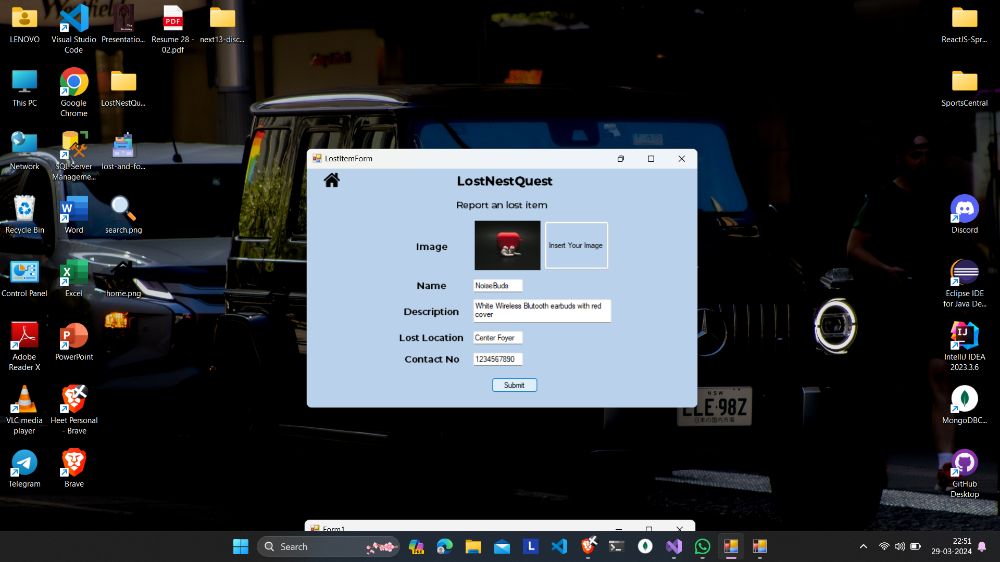

# LostNestQuest

LostNestQuest is an application designed to manage and report lost and found items efficiently. It facilitates users to report items they have lost or found, and browse through a database of items that others have reported. The application aims to simplify the process of recovering lost items and ensuring found items are returned to their rightful owners.

## Features

- **Report Lost Items**: Users can report items they have lost, providing details like item images, descriptions, and contact information.
- **Report Found Items**: Users can also report items they have found, along with similar descriptive details.
- **Search and Filter**: Browse through an extensive database of lost and found items with options to filter and search based on various criteria.
- **Item Management**: Update or delete reports as necessary. Only authorized users can manage item reports to ensure security and integrity.

## Screenshots



## Getting Started

These instructions will get you a copy of the project up and running on your local machine for development and testing purposes.

### Prerequisites

What things you need to install the software and how to install them:

```bash
- Microsoft SQL Server
- .NET Framework 4.7.2 or later
```

## Installing

A step-by-step guide to setting up a development environment:

### Clone the repository

```bash
git clone https://github.com/yourusername/LostNestQuest.git
```

## Setup

### Set up the database

1. **Create a new database in SQL Server.**
2. **Import the database schema** from the provided SQL script files located in the `Database` folder.

### Configure your connection string

- Open the project in **Visual Studio**.
- Navigate to the `Web.config` or `App.config` file and modify the **connection string** to match your database server.

### Build and run the application

- **Build the project** in Visual Studio to resolve dependencies.
- **Run the application**.

## Authors

- **Heet Vadiya** - *LostNestQuest* - heetvadiya(https://github.com/heetvadiya)

## License

This project is licensed under the MIT License - see the [LICENSE.md](LICENSE.md) file for details.


